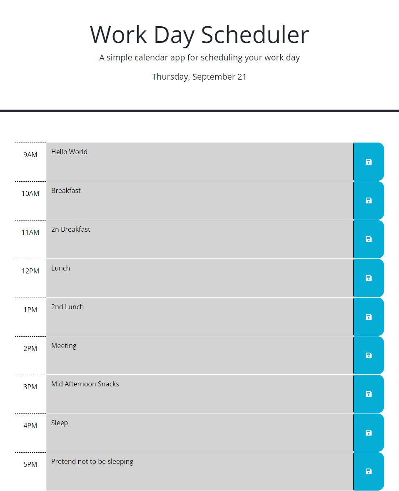

# Daily-Planner

## Description
This project involved the creation of a Daily Planner website for me to use to plan my day activities.

My Motivation?: To learn and test my skills with Third Party APIs

Why Did I Build This Project?: To test and display my knowledge and skills regarding Third Party APIs such as JQuery, DayJS, and Bootstrap

What Problem Does It Solve?: It Provides me with an easily editable, reliable tool to help plan my daily activities.

What did I learn?: I learned a lot about how powerful these Third Party APIs can be in their use on websites. How I can use them to dynamically alter website information and styling in relation to the current date and time. How I can traverse the DOM using JQuery be that looking for parent or child elements or the "this" selector.

## Installation

No Installations are required.

## Usage

Website URL: https://danyon-talbot.github.io/Daily-Planner/

## Credits

* [W3 Schools JQuery](https://www.w3schools.com/jquery/default.asp)

* [DayJS](https://day.js.org/en/)

* [JQuery.com](https://jquery.com/)